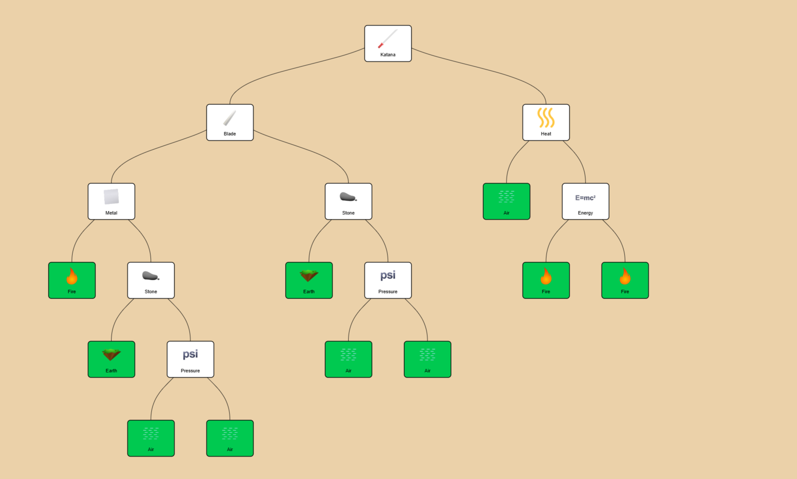

# <h1 align="center">Tugas Besar 2 IF2211 Strategi Algoritma</h1>
<h2 align="center">Semester II tahun 2024/2025</h2>
<h3 align="center">Recipe Search in Little Alchemy 2 Using BFS and DFS</h3>

<p align="center">
  
</p>

## Table of Contents
- [Description](#description)
- [DFS, BFS, & Bidirectional Search](#algorithms-implemented)
- [Program Structure](#program-structure)
- [Requirements & Installation](#requirements--installation)
- [Author](#author)
- [References](#references)

## Description
This program is a web application for a Little Alchemy 2 element recipe finder. The application utilizes graph traversal methods such as Breadth-First Search, Depth-First Search, and Bidirectional Search to look for elements required to create your targe element. The resulting recipe will be visualized, with a live update visualization available as an option. 

## Algorithms Implemented
### 1. BFS
Breadth-First Search is implemented

### 2. DFS
Depth-First Search is implemented using recursion calls, where each valid nodes are added on to the tree, and each recipe elements will then be processed through recursion.

### 3. Bidirectional

## Program Structure
### Backend
```
.
├── doc
│   └── Bolang.pdf
├── Dockerfile
├── README.md
└── src
    ├── bfs.go
    ├── bidirectional.go
    ├── data
    │   └── elements.json
    ├── dfs.go
    ├── go.mod
    ├── go.sum
    ├── main.go
    ├── scrapper.go
    └── treebuilder.go

4 directories, 12 files
```
- **src** : contains source code for algorithms and other backend implementations for the Web Application
- **doc** : contains the assignment report and program documentation.

### Frontend
```
.
├── docker-compose.yml
├── Dockerfile
├── eslint.config.mjs
├── next.config.ts
├── next-env.d.ts
├── package.json
├── package-lock.json
├── postcss.config.mjs
├── public
│   ├── file.svg
│   ├── globe.svg
│   ├── icon
│   │   └── search.svg
│   ├── image.png
│   ├── next.svg
│   ├── vercel.svg
│   └── window.svg
├── README.md
├── src
│   ├── app
│   │   ├── favicon.ico
│   │   ├── globals.css
│   │   ├── layout.tsx
│   │   ├── page.tsx
│   │   └── result
│   │       └── page.tsx
│   ├── components
│   │   ├── ParameterBar
│   │   │   └── page.tsx
│   │   ├── ResultBar
│   │   │   └── page.tsx
│   │   ├── TreeClientWrapper.tsx
│   │   └── TreeRecipe
│   │       ├── page.tsx
│   │       └── TreeClient.tsx
│   ├── data
│   │   ├── basic.json
│   │   ├── elements.json
│   │   ├── images.json
│   │   └── recipe.json
│   ├── Tree
│   │   └── TreeRecipe.tsx
│   └── types
│       └── types.tsx
└── tsconfig.json

13 directories, 33 files
```


## Requirements & Installation

Before running the application, you have two options:

### 1. Use the Website Directly
You can access the live version of the application [here](https://alchemy-bolang.vercel.app/).

### 2. Run It Locally
If you prefer to run the application locally, follow these steps:

---

## Clone the Repositories

**Frontend**
```bash
git clone https://github.com/azfaradhi/Tubes2_FE_Bolang
```

**Backend**
```bash
git clone https://github.com/Ferdin-Arsenic/Tubes2_BE_Bolang
```

> Make sure to place both repositories in the **same root directory**.

---

### ⚙️ Create `docker-compose.yml`

Create a file named `docker-compose.yml` in the root directory (the folder containing both frontend and backend repos), and add the following content:

```yaml
version: "3.8"

services:
  frontend:
    build:
      context: ./Tubes2_FE_Bolang
      args:
        NODE_ENV: development
    ports:
      - "3000:3000"
    environment:
      - NEXT_PUBLIC_ENVIRONMENT=local
    depends_on:
      - backend
    networks:
      - app-network

  backend:
    build:
      context: ./Tubes2_BE_Bolang
    ports:
      - "8080:8080"
    networks:
      - app-network

networks:
  app-network:
    driver: bridge
```

This setup will automatically install all required dependencies.

---

### 📄 Add `.env` File for Frontend

Inside the `Tubes2_FE_Bolang` directory, create a file named `.env` and add the following content:

```env
NEXT_PUBLIC_ENVIRONMENT=local
NEXT_PUBLIC_LOCAL_WEBSOCKET_URL=ws://localhost:8080/ws
```

---

### 🚀 Run the Application

Open your terminal in the root directory (where the `docker-compose.yml` file is located), and run:

```bash
docker compose up --build
```

Once the build is complete, the application will be available at:  
[http://localhost:3000](http://localhost:3000)


## Author
| **NIM**  | **Nama Anggota**               | **Github** |
| -------- | ------------------------------ | ---------- |
| 13523025 | M. Rayhan Farrukh              | [grwna](https://github.com/grwna) |
| 13523115 | Azfa Radhiyya Hakim            | [azfaradhi](https://github.com/azfaradhi) | 
| 13523117 | Ferdin Arsenarendra Purtadi    | [Ferdin-Arsenic](https://github.com/Ferdin-Arsenic) |

## References
- [Spesifikasi Tugas Besar 2 Stima 2024/2025](https://docs.google.com/document/d/1aQB5USxfUCBfHmYjKl2wV5WdMBzDEyojE5yxvBO3pvc/edit?tab=t.0)
- [Slide Kuliah IF2211 2024/2025 Algoritma BFS dan DFS (Bagian 1)](https://informatika.stei.itb.ac.id/~rinaldi.munir/Stmik/2024-2025/13-BFS-DFS-(2025)-Bagian1.pdf)
- [Slide Kuliah IF2211 2024/2025 Algoritma BFS dan DFS (Bagian 2)](https://informatika.stei.itb.ac.id/~rinaldi.munir/Stmik/2024-2025/14-BFS-DFS-(2025)-Bagian2.pdf)
- [Little Alchemy 2 Fandom](https://little-alchemy.fandom.com/wiki/Elements_(Little_Alchemy_2))
- [Golang Documentation](https://go.dev/doc/)